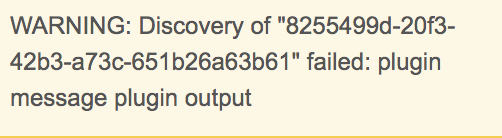

#Exception Handling in Plugin code


###Raising Exceptions in plugin code
Plugin authors can choose to fail a plugin operation by raising a custom exception named UserError available in sdk platform.

It can be imported in the plugin code as shown below.

```python
import dlpx.virtualization.platform.exceptions.UserError
```

Once imported, this UserError can be used to fail the plugin operations with a custom message, action and output as shown below.
message field is required while action and output fields of this UserError are optional.

```python
raise UserError(message='plugin message', action='plugin action', output='plugin output')
```


UserError with only message can be raised as shown below. Default value of action is 'Contact the plugin author to correct the error.' while default value of output is the stacktrace.


```python
raise UserError('plugin message')
```

During plugin operation, if this UserError is encountered, the job fails and the corresponding details will be displayed in Delphix UI as shown below.

