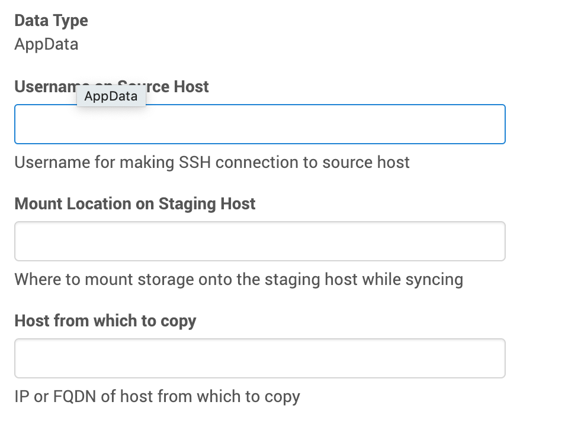

# Data Ingestion

## How Does Delphix Ingest Data?

As [previously](Discovery.md) discussed, the Delphix Engine uses the [discovery](/References/Glossary.md#discovery) process to learn about datasets that live on a [source environment](/References/Glossary.md#source-environment). In this section we will learn how the Delphix Engine uses a two-step process to ingest a dataset.

### Linking

The first step is called [linking](/References/Glossary.md#linking). This is simply the creation of a new dataset on the Delphix Engine, which is associated with the dataset on the source environment. This new linked dataset is called a [dSource](/References/Glossary.md#dsource).

### Syncing

Immediately after linking, the new dSource is [synced](/References/Glossary.md#syncing) for the first time. Syncing is a process by which data from the source environment is copied onto the Delphix Engine. Subsequent syncs may then be periodically performed in order to keep the dSource up-to-date.

The details of how this is done varies significantly from plugin to plugin. For example, some plugins will simply copy files from the filesystem. Other plugins might contact a DBMS and instruct it to send backup or replication streams. There are many possibilities here, but they all break down into two main strategies that the plugin author can choose from: direct and staging.

With the [direct](/References/Glossary.md#direct-linkingsyncing) strategy, the plugin is not in charge
of the data copying. Instead the Delphix Engine directly pulls raw data from the source environment.
The plugin merely provides the location of the data. This is a very simple strategy, and is also
quite limiting.

For our first plugin, we will be using the more flexible [staging](/References/Glossary.md#staged-linkingsyncing) strategy. With this strategy, the Delphix Engine uses NFS for Unix environments (or iSCSI on Windows environments) to mount storage onto a [staging environment](/References/Glossary.md#staging-environment). Our plugin will then be in full control of how to get data from the source environment onto this storage mount.

With the staging strategy, there are two types of syncs: sync and resync. A `sync` is used to ingestion incremental changes while a `resync` is used to re-ingest all the data for the dSource. For databases, this could mean re-ingesting from a full database backup to reset the dSource. A `sync` and a `resync` execute the same plugin operations and are differentiated by a boolean flag in the [snapshot_parameters](/References/Classes.md#snapshotparametersdefinition) argument passed into [linked.pre_snapshot](/References/Plugin_Operations.md#staged-linked-source-pre-snapshot) and [linked.post_snapshot](/References/Plugin_Operations.md#staged-linked-source-post-snapshot).

A regular `sync` is the default and is executed as part of policy driven syncs. A `resync` is only executed during initial ingestion or if the Delphix user manually starts one. The customer can manually trigger a `resync` via the UI by selecting the dSource, going to more options and selecting **Resynchronize dSource**. 

!!! tip "Gotcha"
    Although it is not common, it is entirely possible that the staging environment is the same as the source environment. Be careful not to assume otherwise in your plugins.

### Our Syncing Strategy

For our purposes here in this intro plugin, we will use a simple strategy. We won't do anything with the resync snapshot parameter and simply copy files from the filesystem on the source environment onto the NFS mount on the staging environment. We will do this by running the Unix tool `rsync` from our staging environment, and rely on passwordless SSH to connect to the source environment.

!!! info
    This plugin is assuming that `rsync` is installed on the staging host, and that the staging
    host user is able to SSH into the source host without having to type in a password. A more
    full-featured plugin would test these assumptions, usually as part of discovery.

In the special case mentioned above, where the staging environment is the same as the source environment, we could likely do something more efficient. However, for simplicity's sake, we won't do that here.

## Defining Your Linked Source Data Format

In order to be able to successfully do the copying required, plugins might need to get some information from the end-user of your plugin. In our case, we need to tell `rsync` how to access the files. This means we need to know the source environment's IP address (or domain name), the username we need to connect as, and finally the location where the files live.

Again, we will be using a JSON schema to define the data format. The user will be presented with a UI that lets them provide all the information our schema specifies.

Open up `schema.json` in your editor/IDE. Locate the `LinkedSourceDefinition` and replace it with the following schema:
```json
"linkedSourceDefinition": {
    "type": "object",
    "additionalProperties": false,
    "required": ["sourceAddress", "username", "mountLocation"],
    "properties": {
        "sourceAddress": {
            "type": "string",
            "prettyName": "Host from which to copy",
            "description": "IP or FQDN of host from which to copy"
        },
        "username": {
            "type": "string",
            "prettyName": "Username on Source Host",
            "description": "Username for making SSH connection to source host"
        },
        "mountLocation": {
            "type": "string",
            "format": "unixpath",
            "prettyName": "Mount Location on Staging Host",
            "description": "Where to mount storage onto the staging host while syncing"
        }
    }
},
```

!!! info
    As will be explained later, this schema will be used to generate Python code.
    All names in the autogenerated Python code will use `lower_case_with_underscores` as attribute names as per Python variable naming conventions.
    That is, if we were to use `mountLocation` as the schema property name, it would be called
    `mount_location` in the generated Python code.


With this schema, the user will be required to provide the source username, the source's IP address, and the staging mount location as part of the linking process.


## Implementing Syncing in Your Plugin

There are three things we must do to implement syncing. First, we need to tell the Delphix Engine
where to mount storage onto the staging environment. Next we need to actually do the work of copying
data onto that mounted storage. Finally, we need to generate any snapshot-related data.

### Mount Specification

Before syncing can begin, the Delphix Engine needs to mount some storage onto the staging host.
Since different plugins can have different requirements about where exactly this mount lives, it is
up to the plugin to specify this location. As mentioned above, our simple plugin will get this
location from the user.

Open up the `plugin_runner.py` file and find the `linked_mount_specification` function (which was generated by `dvp init`). Replace it with the following code:
```
@plugin.linked.mount_specification()
def linked_mount_specification(staged_source, repository):
    mount_location = staged_source.parameters.mount_location
    mount = Mount(staged_source.staged_connection.environment, mount_location)
    return MountSpecification([mount])
```

Let's take this line-by-line to see what's going on here.

```
@plugin.linked.mount_specification()
```
This [decorator](/References/Glossary.md#password-property) announces that the following function
is the code that handles the `mount_specification` operation. This is what allows the Delphix
Engine to know which function to call when it's time to learn where to mount. Every operation
definition will begin with a similar decorator.

```
def linked_mount_specification(staged_source, repository):
```
This begins a Python function definition. We chose to call it `linked_mount_specification`, but we
could have chosen any name at all. This function accepts two arguments, one giving information about
the linked source, and one giving information about the associated repository.

```
    mount_location = staged_source.parameters.mount_location
```

The `staged_source` input argument contains an attribute called `parameters`. This in turn contains
all of the properties defined by the `linkedSourceDefinition` schema. So, in our case, that means
it will contain attributes called `source_address`, `username`, and `mount_location`. Note how any attribute defined in `camelCase` in the schema is converted to `variable_with_underscores`. This line
simply retrieves the user-provided mount location and saves it in a local variable.

```
    mount = Mount(staged_source.staged_connection.environment, mount_location)
```

This line constructs a new object from the [Mount class](/References/Classes.md#mount). This class
holds details about how Delphix Engine storage is mounted onto remote environments. Here, we
create a mount object that says to mount onto the staging environment, at the location specified
by the user.

```
    return MountSpecification([mount])
```

On the line just before this one, we created an object that describes a *single* mount. Now, we
must return a full [mount specification](/References/Glossary.md#mount-specification). In general,
a mount specification is a collection of mounts. But, in our case, we just have one single mount.
Therefore, we use an array with only one item it in -- namely, the one single mount object we
created just above.


### Data Copying

As explained [here](/References/Workflows.md#linked-source-sync), the Delphix Engine will always run the plugin's `preSnapshot` operation just before taking a snapshot of the dsource. That means our `preSnapshot` operation has to get the NFS share into the desired state. For us, that means that's the time to do our data copy.

Unlike the previous operations we've seen so far, the pre-snapshot operation will not be autogenerated by `dvp init`.
So, we will need to add one ourselves.  Open up the `plugin_runner.py` file.

First, we'll add a new import line near the top of the file, so that we can use Delphix's platform libraries (explained below).
```python
from dlpx.virtualization import libs
```


Next, we'll add a new function:

```python
@plugin.linked.pre_snapshot()
def copy_data_from_source(staged_source, repository, source_config, snapshot_parameters):
    stage_mount_path = staged_source.mount.mount_path
    data_location = "{}@{}:{}".format(staged_source.parameters.username,
        staged_source.parameters.source_address,
        source_config.path)

    rsync_command = "rsync -r {} {}".format(data_location, stage_mount_path)

    result = libs.run_bash(staged_source.staged_connection, rsync_command)

    if result.exit_code != 0:
        raise RuntimeError("Could not copy files. Please ensure that passwordless SSH works for {}.\n{}".format(staged_source.parameters.source_address, result.stderr))
```

Let's walk through this function and see what's going on

```python
    stage_mount_path = staged_source.mount.mount_path
```

The `staged_source` argument contains information about the current mount location. Here we save that
to a local variable for convenience.

```python
    data_location = "{}@{}:{}".format(staged_source.parameters.username,
        staged_source.parameters.source_address,
        source_config.path)
```

This code creates a Python string that represents the location of the data that we want to ingest.
This is in the form `<user>@<host>:<path>`. For example `jdoe@sourcehost.mycompany.com:/bin`. As
before with `mountLocation`, we have defined our schemas such that these three pieces of information
were provided by the user. Here we're just putting them into a format that `rsync` will understand.

```python
    rsync_command = "rsync -r {} {}".format(data_location, stage_mount_path)
```

This line is the actual Bash command that we'll be running on the staging host. This will look something like `rsync -r user@host:/source/path /staging/mount/path`.

```python
    result = libs.run_bash(staged_source.staged_connection, rsync_command)
```

This is an example of a [platform library](/References/Glossary.md#platform-libraries) function, where we ask the Virtualization Platform
to do some work on our behalf. In this case, we're asking the platform to run our Bash command on the
staging environment. For full details on the `run_bash` platform library function and others, see this [reference](/References/Platform_Libraries.md).

```python
    if result.exit_code != 0:
        raise RuntimeError("Could not copy files. Please ensure that passwordless SSH works for {}.\n{}".format(staged_source.parameters.source_address, result.stderr))
```
Finally, we check to see if our Bash command actually worked okay. If not, we raise an error
message, and describe one possible problem for the user to investigate.


### Saving Snapshot Data

Whenever the Delphix Engine takes a [snapshot](/References/Glossary.md#snapshot) of a dSource or VDB,
the plugin has the chance to save any information it likes alongside that snapshot. Later, if the
snapshot is ever used to provision a new VDB, the plugin can use the previously-saved information
to help get the new VDB ready for use.

The format of this data is controlled by the plugin's `snapshotDefinition` schema. In our case, we
don't have any data we need to save. So, there's not much to do here. We will not modify the blank
schema that was created by `dvp init`.

We do still need to provide python function for the engine to call, but we don't have to do much.
In fact, the default implementation that was generated by `dvp init` will work just fine for our purposes:

```python
@plugin.linked.post_snapshot()
def linked_post_snapshot(staged_source,
                         repository,
                         source_config,
                         snapshot_parameters):
    return SnapshotDefinition()
```

The only thing this code is doing is creating a new object using our (empty) snapshot
definition, and returning that new empty object.


## How to Link and Sync in the Delphix Engine

Let's try it out and make sure this works!

**Prerequisites**

  - You should already have a repository and source config set up from the previous page.

  - You can optionally set up a new staging environment. Or, you can simply re-use your source
    environment for staging.

**Procedure**

!!! note
    Recall that, for simplicity's sake, this plugin requires that passwordless SSH is set up between
    your staging and source environments. You may want to verify this before continuing.

1. As before, use `dvp build` and `dvp upload` to get your latest plugin changes installed onto
the Delphix Engine.

2. Go to **Manage > Environments**, select your **source** environment, and then go to the **Databases** tab. Find **Repository for our First Plugin**, and your source config underneath it.

3. From your source config click **Add dSource**. This will begin the linking process. The first
screen you see should ask for the properties that you recently added to your `linkedSourceDefinition`. 

4. Walk through the remainder of the screens and hit **Submit**. This will kick off the initial link and first sync.

5. You can confirm that your new dSource was added successfully by going to **Manage > Datasets**.

After you have finished entering this information, the initial sync process will begin. This is what will call your pre-snapshot operation, thus copying data.

!!! warning "Gotcha"
    Manually creating a dSource sets your plugin’s linked source schema in stone, and you will have to recreate the dSource in order to modify your schema. We will cover how to deal with this correctly later, in the upgrade section. For now, if you need to change your plugin's linked source schema, you will have to first delete any dSources you have manually added.

!!! question "[Survey](https://forms.gle/mi7y1Yafz8H3Gq2P9)"
    Please fill out this [survey](https://forms.gle/mi7y1Yafz8H3Gq2P9) to give us feedback about this section.
