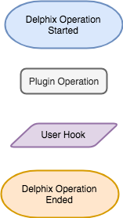
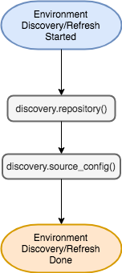
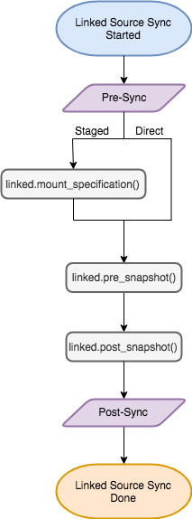
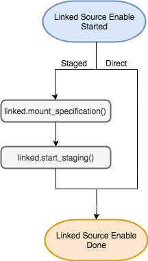
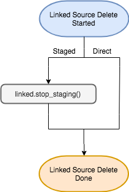
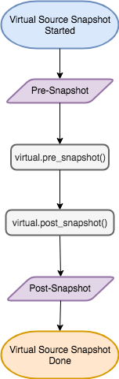
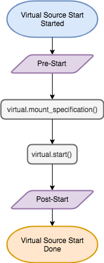
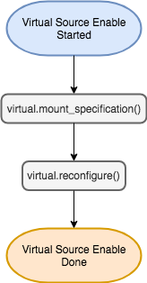

# Workflows

## Legend

## Environment Discovery / Refresh

## Linked Source Sync

## Linked Source Enable

## Linked Source Disable

## Linked Source Delete

## Virtual Source Provision

## Virtual Source Snapshot

## Virtual Source Refresh

## Virtual Source Rollback

## Virtual Source Delete

## Virtual Source Start

## Virtual Source Stop

## Virtual Source Enable

## Virtual Source Disable

