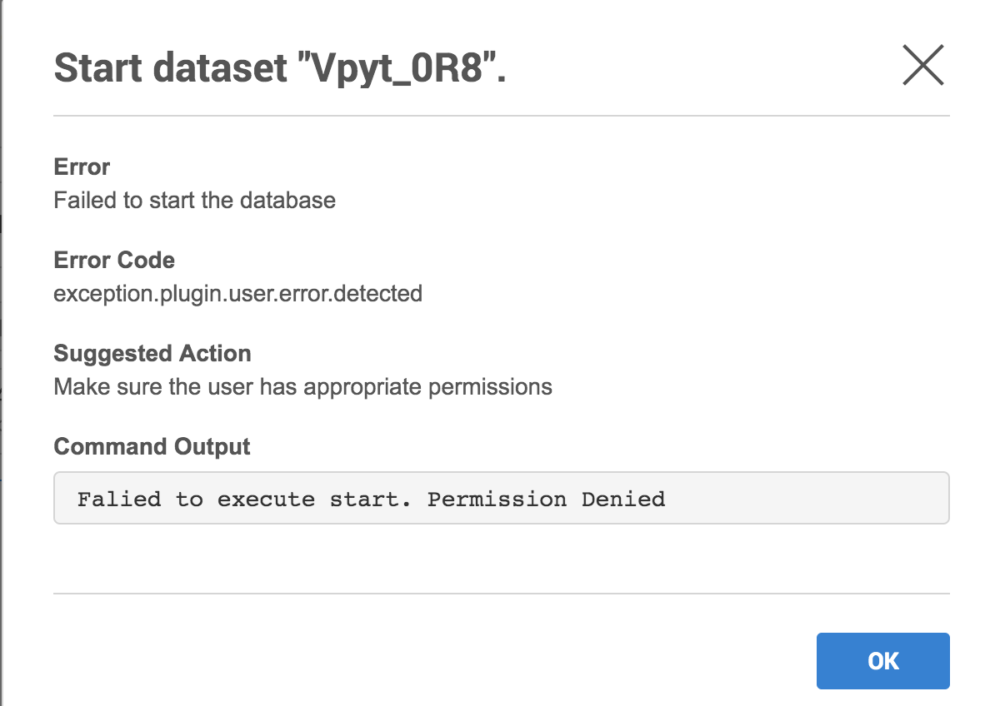

# User Visible Errors

Plugin authors can choose to fail a plugin operation by raising an exception of type `UserError` with a custom message, action and output for the end user.

## Fields

Field | Type | Description
----- | ---- | -----------
message | String | Description of the failure to show the end user.
action | String | **Optional**. List of actions that the end user could take to fix the problem. If not provided, it defaults to `Contact the plugin author to correct the error.`
output | String | **Optional**. Output or stack trace from the failure to give the end user more information so that they can self diagnose. If not provided, it defaults to the stack trace of the failure.


## Example

```python
import pkgutil
from dlpx.virtualization.platform import Plugin
from generated.definitions import SourceConfigDefinition
from dlpx.virtualization.platform.exceptions import UserError

plugin = Plugin()

@plugin.virtual.start()
def start(virtual_source, repository, source_config):
  script_content = pkgutil.get_data('resources', 'start_database.sh')

  response = libs.run_bash(virtual_source.connection, script_content)

  # Fail operation if the database could not be started
  if response.exit_code != 0:
    raise UserError(
    'Failed to start the database',
    'Make sure the user has appropriate permissions',
    '{}\n{}'.format(response.stdout, response.stderr))
```

The UI would show the end user if the plugin operation above fails:

