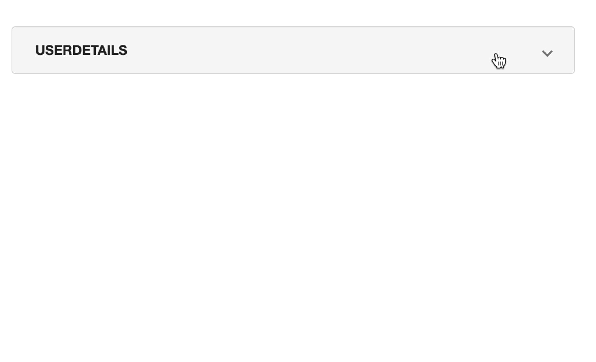
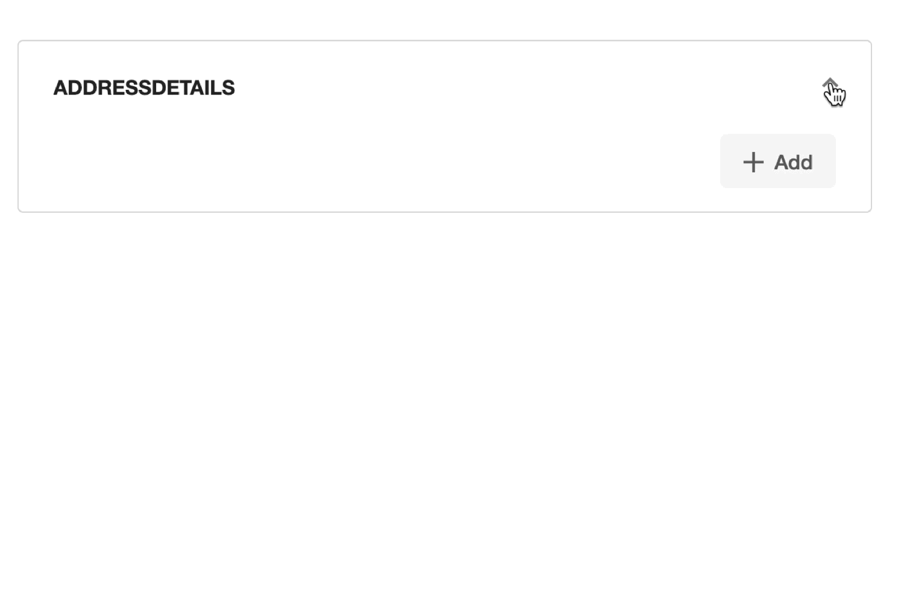

# Collapsible Section
Collapsible Section provides plugin developers capability to create properties that can be collapsed or expanded as per 
user choice. `Collapsible Section` allows to reduce number of properties shown on the UI at a time to help better 
understand the configuration.

The `collapsible` and `expanded` accepts a boolean value that helps in collapsing all the properties of the `array` 
and `object` type.

## Schema Configuration

### Attributes
|  Attribute  |  Value  |                                                   Description                                                   |
|:-----------:|:-------:|:---------------------------------------------------------------------------------------------------------------:|
| collapsible | boolean |                     If `true`, the property will be allowed to collapse as per user choice.                     |
|  expanded   | boolean | If `true`, the property will be expanded by default. The attribute is used when `collapsible` is set to `true`. |

### Where
- As a Sub-schema of [dxFormProperties](../Schemas.md#dxformproperties), for `array` and `object` type properties.

### Applicable Data Types
- object
- array

### Usage
```json title="Schema" hl_lines="4 5 6 7"
{
  "<Property_Name>": {
    "type": "object",
    "dxFormProperties": {
      "collapsible": <boolean true or false>,
      "expanded": <boolean true or false>
    }
  }
}

```

## Examples

???+ example "Examples"
    === "Example 1"
        `userDetails` is an object property which is allowed to collapse and is collapsed by default. `userName` and `password` are part of the collapsed section. 
        ```json
        {
          "userDetails": {
            "type": "object",
            "dxFormProperties": {
              "collapsible": true,
              "expanded": false
            },
            "properties": {
              "userName": {
                "type": "string"
              },
              "password": {
                "type": "string"
              }
            }
          }
        }
        ```
        
    === "Example 2"
        `addressDetails` is an array property which is allowed to collapse and is expanded by default. Each array item with `pinCode` and `number` is allowed to collapsed and is collapsed by default.
        ```json
        {
          "addressDetails": {
            "type": "array",
            "dxFormProperties": {
              "collapsible": true,
              "expanded": true
            },
            "items": {
              "type": "object",
              "dxFormProperties": {
                "collapsible": true,
                "expanded": false
              },
              "properties": {
                "pinCode": {
                  "type": "string"
                },
                "number": {
                  "type": "string"
                }
              }
            }
          }
        }
        ```
        
