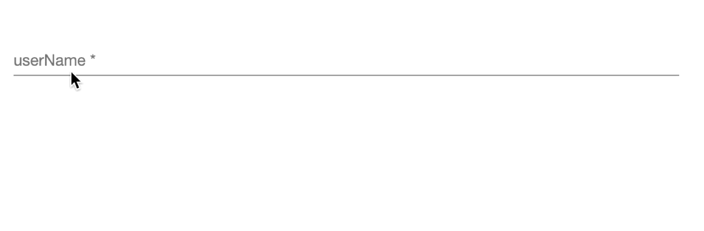
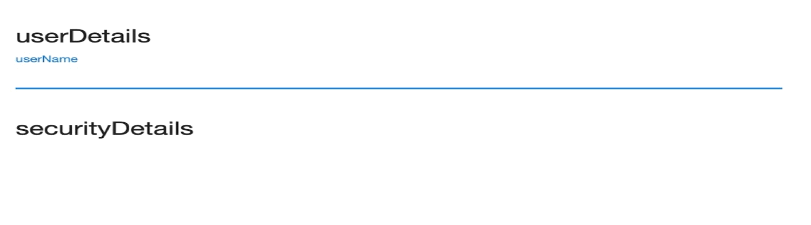

# Hidden Properties
Hidden Properties provides plugin developers capability to provide properties that will be shown to user once certain conditions or 
checks are successful based on user inputs. `Hidden Properties` help plugin developers control the flow of user inputs by 
showing only the required properties at first and show the remaining properties based on the user input afterward.

The `hideExpression` accepts an expression that evaluates to a boolean value. The expression can access values from 
other properties. Access values from other properties as below:

??? abstract "model.<property_name\>"
    !!! example inline ""
        ```json
        {
          "X": "", 
          "Y": ""
        }
        ```
    - Use the `model.<property_name>` when the properties are string, boolean, number or integer.
    - To hide Y based on X, use `model.X` or `model?.X`
??? abstract "field.parent.<N\>.parent.model?.<property_name\>"
    Use the `model.<property_name>` when the properties are object and array.
    === "Object Schema"
        !!! example inline ""
            ```json
            {
              "X": "", 
              "Y": {
                "Z": ""
              }
            }
            ```
        - To hide Y (object itself), use `field.parent.model?.X`.
        - To hide Z based on X, use `field.parent.parent.model?.X`.
    === "Array Schema"
        !!! example inline ""
            ```json
            {
              "X": "", 
              "Y": [
                {
                  "Z": ""
                }
              ]
            }
            ```
        - To hide Y (array object) based on X, use `field.parent.model?.X`
        - To hide Z based on X, use `field.parent.parent.parent.model?.X`
??? abstract "field.parent.<N\>.parent.model?.<root_names\>?.<property_name\>"
    !!! example inline ""
        ```json
        {
          "A": {
            "B": ""
          }, 
          "X": {
            "Y": ""
          }
        }        
        ```
    - Use the `field.parent.<N>.parent.model?.<root_names>?.<property_name>` when the properties have different root object.
    - To hide Y based on B, use `field.parent.parent.model?.A?.B`

!!! info 
    `parent.<N>.parent` - Parent repeated N times as per JSON structure
  
## Schema Configuration

### Attributes
|   Attribute    |  Value  |                             Description                              |
|:--------------:|:-------:|:--------------------------------------------------------------------:|
| hideExpression | boolean | If the value evaluates to true, the property is not shown in the UI. |

### Where
- As a Sub-schema of [dxFormProperties](../Schemas.md#dxformproperties), for all data types property.

### Applicable Data Types
- string
- integer
- number
- array
- object
- boolean

### Usage
```json title="Schema" hl_lines="4 5 6"
{
  "<Property_Name>": {
    "type": "string",
    "dxFormProperties": {
      "hideExpression": "<expression that evaluates to a boolean value>"
    }
  }  
}
```
!!! warning
    The expression works across a definition only. Plugin developers will not be able to use properties from multiple 
    definitions as defined in [schemas](../Schemas_and_Autogenerated_Classes.md). For example, a property from 
    [linkedSourceDefinition](../Schemas_and_Autogenerated_Classes.md#linkedsourcedefinition) can not be used 
    in [snapshotDefinition](../Schemas_and_Autogenerated_Classes.md#snapshotdefinition).

## Examples

???+ example "Examples"
    === "Expressions"
        |                     Expression                      |                           Description                           |
        |:---------------------------------------------------:|:---------------------------------------------------------------:|
        |                 `!model.userName`                   |         Returns true if the userName property is empty.         |
        |                `model.booleanFlag`                  |     Returns true or false based on the booleanFlag property     |
        |          `model.backupType === 'PRIMARY'`           |       Returns true if the backupType property is PRIMARY.       |
        | `model.backupType !== 'PRIMARY' && !model.userName` | Return true if backupType is not primary and userName is empty. |
    === "Common Root Object"
        `password` is a string property which will be shown in the UI if `userName` is present and not empty.
        ```json
        {
          "userName": {
            "type": "string"
          },
          "password": {
            "type": "string",
            "dxFormProperties": {
              "hideExpression": "!model.userName"
            }
          }
        }
        ```
        
    === "Different Root Object"
        `password` is a string property which will be shown in the UI if `userName` is present and not empty.
        ```json
        {
          "userDetails": {
            "type": "object",
            "properties": {
              "userName": {
                "type": "string"
              }
            }
          },
          "securityDetails": {
            "type": "object",
            "properties": {
              "password": {
                "type": "string",
                "dxFormProperties": {
                  "hideExpression": "!field.parent.parent.model?.userDetails?.userName"
                }
              }
            }
          }
        }
        ```
        