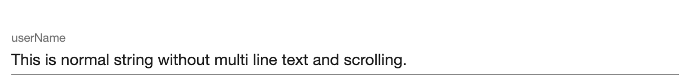
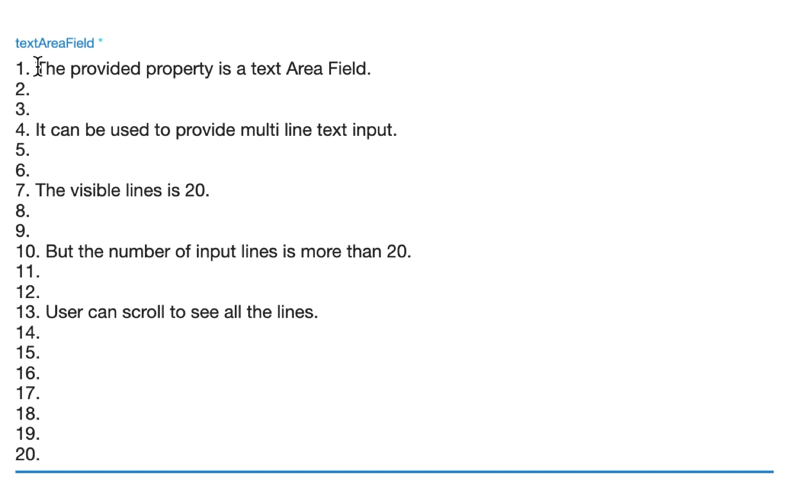

# Text Area
Text Area Property provides plugin developers capability to create properties in Delphix engine UI which is used 
for `multi line text` input. `Text Area` allows users to enter large amount of text, for example a shell script or comments.

All `string` type properties can be converted to `Text Area` properties by providing `rows` configuration to adjust the height of the property. 

* The number of visible lines or `rows` count does not limit the number of input lines.
* A user can input `n` number of lines but at a time UI will only show lines as provided in `rows` configuration.
    * A user can scroll to see all the lines.

## Schema Configuration

### Attributes
| Attribute | Value  |                           Description                           |
|:---------:|:------:|:---------------------------------------------------------------:|
|   rows    | number | Specifies the height and number of visible lines for text area. |

### Where
* As a Sub-schema of [dxFormProperties](../Schemas.md#dxformproperties), for `string` type property.

### Applicable Data Types
* string

### Usage
```json title="Schema" hl_lines="4 5 6"
{
  "<Property_Name>": {
      "type": "string",
      "dxFormProperties": {
        "rows": 5
    }
  }
}
```

## Examples
???+ example "Examples"
    === "Example 1"
        `userName` is a string property which will be shown in the UI as a Single line.
        ```json
        {
          "userName": {
            "type": "string"
          }
        }
        ```
        
    === "Example 2"
        `textAreaField` is a string property which will be shown in the UI as a Text Area with 20 visible lines.
        ```json
        {
          "textAreaField": {
            "type": "string",
            "dxFormProperties": {
              "rows": 20
            }
          }
        }
        ```
        
