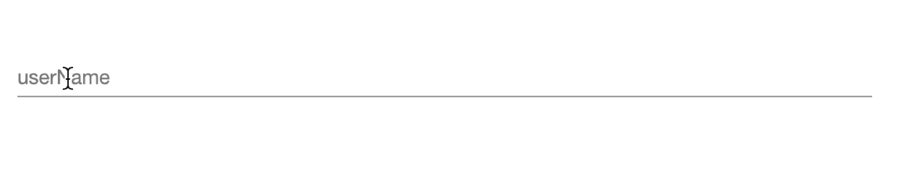
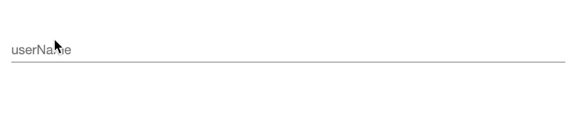

# Validation Messages
Validation messages provides plugin developers capability to provide custom validation error messages for user inputs
in Delphix Engine UI. `Validation messages` helps user better understand the input requirements and provide the input
that matches the plugin developers requirements.

Data types which provide validations for the user input, for example

* `pattern`, `minLength` for `string`
* `minItems`, `maxItems` for `array` 

can have `Custom Validation Messages`.

For each validation check within a property, plugin developers can provide a validation message. The validation message
will be shown for the first failed validation check.

## Schema Configuration

### Attributes
|     Attribute      | Value  |                                     Description                                      |
|:------------------:|:------:|:------------------------------------------------------------------------------------:|
| validationMessages | Object | Key-value to define validation messages for various input validation check keywords. |

#### Supported Keys

|              Keys               | Applicable Data Type |
|:-------------------------------:|:--------------------:|
|       minLength, pattern        |        string        |
| maxItems, minItems, uniqueItems |        array         |
|           multipleOf            |   integer, number    |


### Where
- As a Sub-schema of [dxFormProperties](../Schemas.md#dxformproperties).

### Applicable Data Types
- string
- array
- integer
- number

### Usage
```json title="Schema" hl_lines="6 7 8 9 10 11"
{
  "userName": {
    "type": "string",
    "minLength": 8,
    "pattern": "postgre.*",
    "dxFormProperties": {
      "validationMessages": {
        "minLength": "<Your Custom Validation Message which represents \"minLength\" validation check.>",
        "pattern": "<Your Custom Validation Message which represents \"pattern\" validation check.>"
      }
    }
  }
}
```


## Examples

???+ example "Examples"
    === "Example 1"
        No error message will be shown in case of validation check failure.
        ```json
        {
          "userName": {
            "type": "string",
            "minLength": 8,
            "pattern": "postgre.*"
          }
        }
        ```
        
    === "Example 2"
        Only `minLength` validation error message will be shown in case of length constraint failure.
        ```json
        {
          "userName": {
            "type": "string",
            "minLength": 8,
            "pattern": "postgre.*",
            "dxFormProperties": {
              "validationMessages": {
                "minLength": "The minimum length for \"userName\" should be 8."
              }
            }
          }
        }
        ```
        
    === "Example 3"
        Both `minLength` and `pattern` validation error message will be shown based on input validation check failure.
        ```json
        {
          "userName": {
            "type": "string",
            "minLength": 8,
            "pattern": "postgre.*",
            "dxFormProperties": {
              "validationMessages": {
                "minLength": "The minimum length for \"userName\" should be \"8\".",
                "pattern": "The \"userName\" should start with \"postgre\"."
              }
            }
          }
        }
        ```
        
