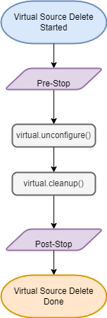

# Workflows

## Legend

## Environment Discovery / Refresh

## Linked Source Sync

## Linked Source Enable

## Linked Source Disable

## Linked Source Delete

## Virtual Source Provision

## Virtual Source Snapshot

## Virtual Source Create Empty VDB

## Virtual Source Refresh

## Virtual Source Rollback

## Virtual Source Delete

## Virtual Source Start

## Virtual Source Stop

## Virtual Source Enable

Note: pre- and post-start hooks are only run if `extendedStartStopHooks` is set to `true` in the [plugin config](Plugin_Config.md).

## Virtual Source Disable

Note: pre- and post-stop hooks are only run if `extendedStartStopHooks` is set to `true` in the [plugin config](Plugin_Config.md).

## Upgrade

